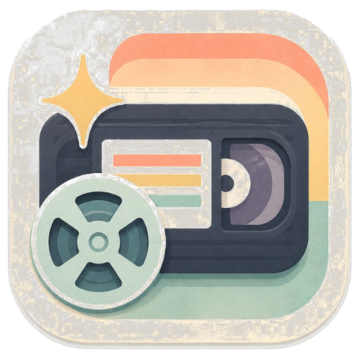

<p align="center">
  
</p>

<h1 align="center">Compressi</h1>

<p align="center">
  Fast, local video compression for Windows — powered by FFmpeg.
</p>

<p align="center">
  <a href="https://github.com/thomasboyle/compressi/releases/latest/download/Compressi-Setup-x64.exe">
    
  </a>
</p>

<p align="center">
  <a href="https://github.com/thomasboyle/compressi/releases/latest"></a>
  <a href="https://github.com/thomasboyle/compressi/releases"></a>
  
  
  
</p>

## Features

- **8 MB Target** — size videos for Discord and chat apps
- **Presets** — Ultra, 8 MB Target, and Balanced
- **Formats** — MP4, MKV, WebM
- **GPU encode** — NVENC / QSV / AMF when available, CPU fallback otherwise
- **History** — reopen past outputs from the app

## Install

1. Download the [latest installer](https://github.com/thomasboyle/compressi/releases/latest/download/Compressi-Setup-x64.exe)
2. Run `Compressi-Setup-x64.exe`
3. Drop a video on Compress and hit **Start Compression**

Requires Windows 10 (1809+) or Windows 11, x64.

## Build

```powershell
# App
dotnet build Compressi.slnx -c Release

# Installer (needs Inno Setup 6 + FFmpeg binaries in Compressi.App/Assets/ffmpeg)
.\scripts\build-installer.ps1
```

## License

App source: see repository. Bundled FFmpeg is LGPL/GPL depending on build — [ffmpeg.org](https://ffmpeg.org/).
